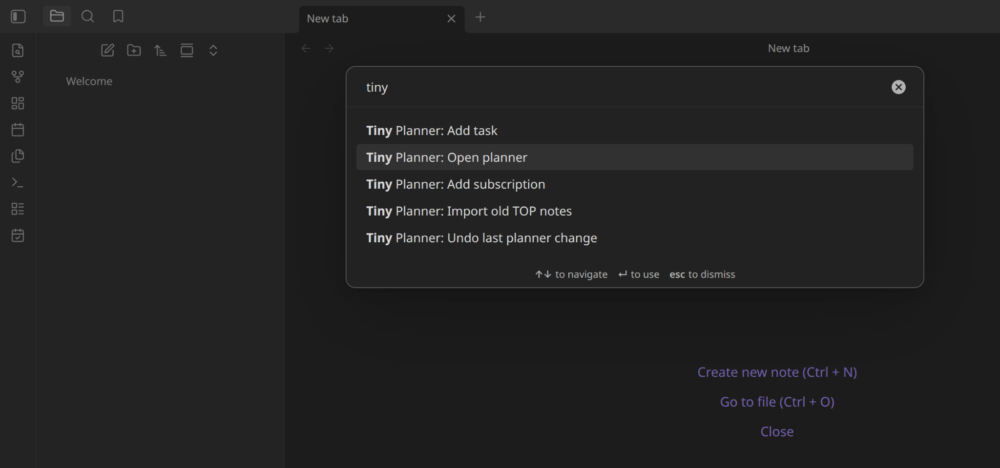
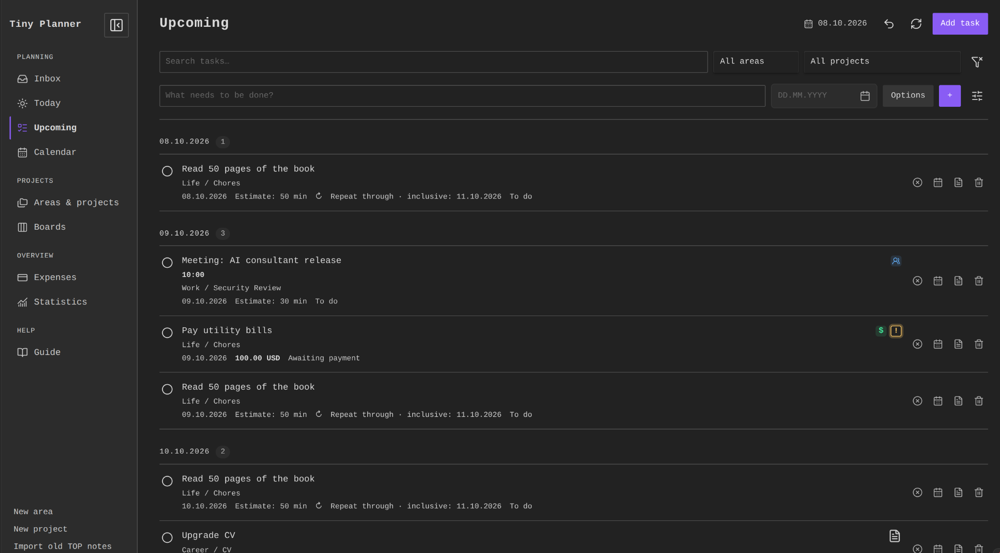
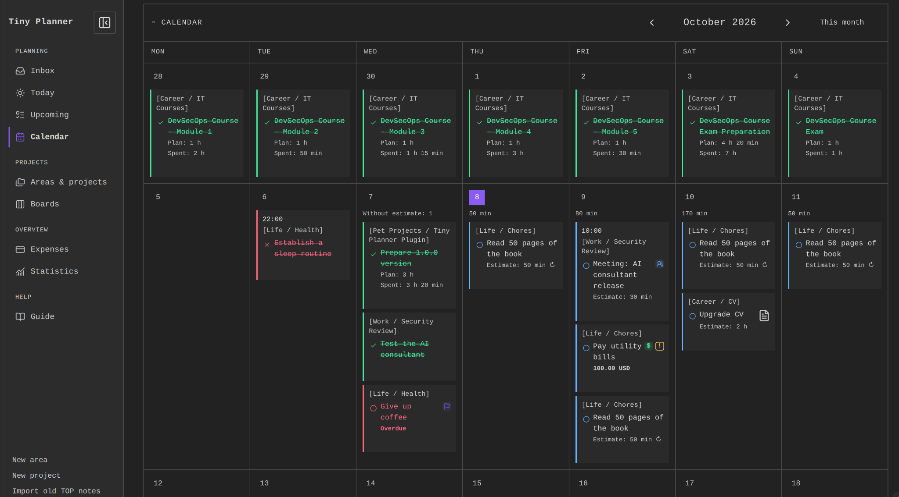
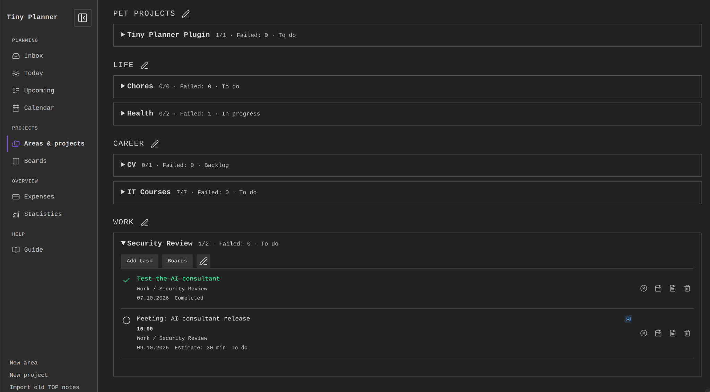
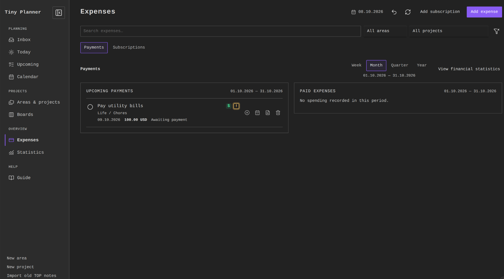
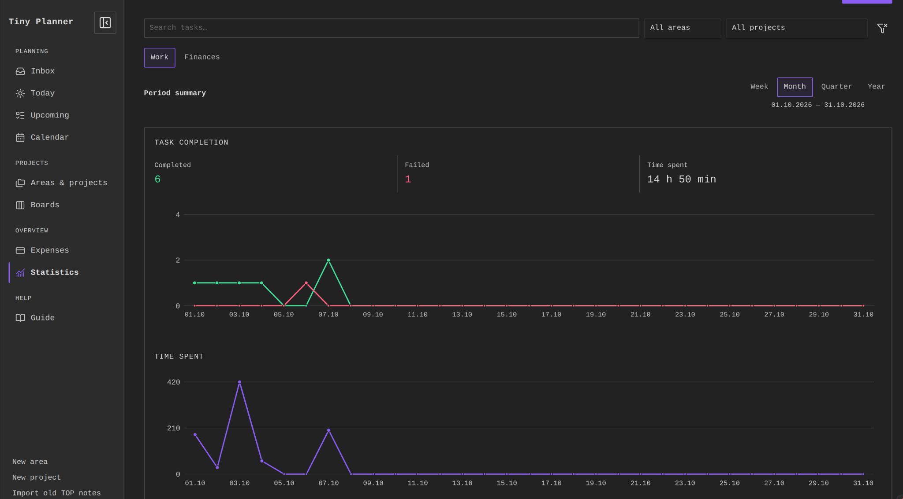
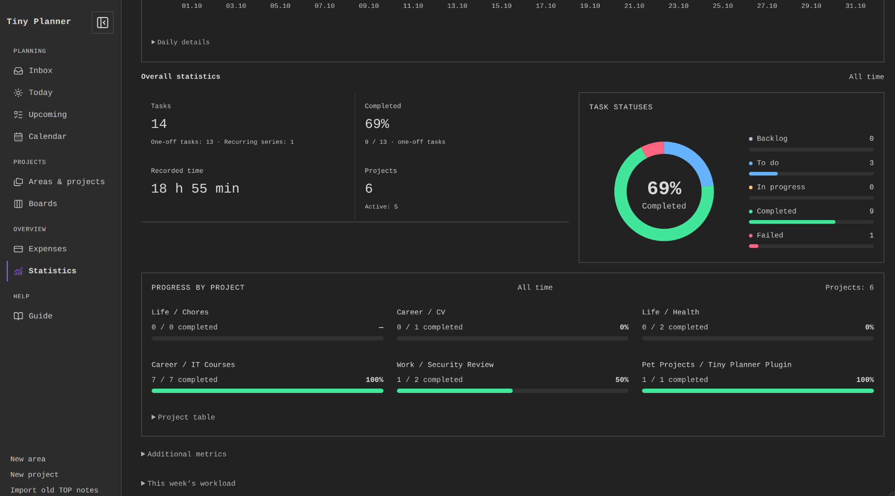

# Tiny Planner

A local planner for **Obsidian** that brings work, home tasks and expenses together. Tasks, areas, projects and payment history live in Markdown notes in your vault. No Dataview, TaskNotes, account or runtime internet connection is required.

## Features

| View                      | What you can do                                                                                           |
| ------------------------- | --------------------------------------------------------------------------------------------------------- |
| Today, Inbox and Upcoming | Capture tasks, review overdue work and plan the next few days.                                            |
| Calendar                  | Use Day, Week or Month; move work dates or deadlines and independently hide completed or recurring tasks. |
| Areas & projects          | Organize work, set project deadlines and review progress.                                                 |
| Boards                    | Move tasks through Backlog, To do, In progress, Done and Failed.                                          |
| Statistics                | Review work and spending for the current calendar week, month, quarter or year.                           |
| Expenses                  | Manage payments, paid history and subscriptions.                                                          |
| Budgets                   | Set optional monthly limits by project or area, separately for each currency.                             |
| Guide                     | Read the built-in instructions in English or Russian.                                                     |

Recurring tasks support presets and custom date-based RRULEs, independent occurrence history and optional end dates. Tasks have a planned date, a separate deadline, an optional estimate and separately recorded actual minutes. Existing additional work dates in notes remain supported by the calendar and workload calculations.

The interface follows the theme's accent color, with semantic status colors, full wrapping titles and responsive controls. The left menu collapses through one panel icon. Dates stay beside the relevant heading or period controls. Detailed tables are collapsed until requested.

## Installation

Requires **Obsidian 1.7.2 or newer**. Node.js is needed only for source development.

### Manual installation

1. Download `main.js`, `manifest.json` and `styles.css` from the same GitHub release.
2. Put them directly in `<vault>/.obsidian/plugins/tiny-planner/`. Use your actual configuration directory if it differs from `.obsidian`.
3. Reload Obsidian and enable **Tiny Planner** in **Settings → Community plugins**.
4. Use the calendar-check ribbon icon or **Tiny Planner: Open planner** in the command palette.

To update, replace those three files and reload. Planner notes remain in the vault.

## Getting started

After enabling the plugin, open Obsidian's command palette, search for `Tiny Planner`, and select **Tiny Planner: Open planner**. You can also use the calendar-check icon in the left ribbon.



1. Create an area such as Work or Home in **Areas & projects**.
2. Add a project under that area.
3. Enter a title in **Today** and press Enter or **+**. **Options** reveals additional quick-entry fields; the sliders icon opens the full form.
4. Click a task title to edit it. Use the checkmark, failure control or Boards to change its status.
5. Set the task date and deadline in its form, plan in Calendar and read the Guide for the detailed mechanics.

Tasks can have no date or project. Inbox collects tasks without a resolved project. Language and date format are configurable in plugin settings; Russian is the initial default. Supported formats are `DD.MM.YYYY`, `MM/DD/YYYY` and `YYYY-MM-DD`.

## Screenshots

### Upcoming

Review upcoming tasks grouped by date, including appointments, payments and recurring tasks. Search or filter by area and project, and add tasks from the quick-entry row.



### Calendar

Plan tasks in Day, Week or Month view. This month view shows task statuses, appointments and payments, with planned and recorded time on completed work.



### Areas & projects

Group projects by area and review their progress. Expand a project to see its tasks, add new work or open its board.



### Expenses

Manage upcoming payments and paid expenses side by side for the selected calendar period. Switch to Subscriptions to manage recurring charges, or open financial statistics for spending reports.



### Statistics: period summary

Review completed and failed work and recorded time for the current week, month, quarter or year. Charts cover the full selected period; expand Daily details for individual values.



### Statistics: overall progress

See task and project totals, recorded time, the status distribution and progress by project. This overview covers all time, separately from the selected period summary above it.



## Planning and reporting

- Calendar orders Done, then Failed, then unfinished tasks, considering appointment times within each group. Subscriptions and separate deadline cards appear at the bottom of their day.
- A multi-day task appears on selected work dates and its deadline, without filling intervening days. Moving a work card changes that day; moving a deadline card changes the deadline.
- Dated boards place closed work on its resolution day, falling back to the planned day when no resolution date was recorded. A later deadline does not keep closed tasks on Today; All retains their history.
- Planned minutes and actual minutes are separate. Completed work cards show Plan and positive recorded Spent values. Missing estimates remain explicitly unknown in workload totals.
- Daily capacity defaults to 480 minutes. Weekly/monthly views retain daily availability rather than inventing a single period limit.
- Reporting periods cover the complete current Monday–Sunday week, month, quarter or year. Closing old work today credits its original planned reporting day; its actual resolution date is stored separately.
- Closed time totals include Done/Failed minutes. Reopening removes them from closed totals while keeping the entries. Payments and subscriptions do not increase work metrics.
- Financial history uses actual payment dates. All currencies remain visible in separate line charts with independent monetary scales and matching date ranges. Exact daily values are available together; currencies are never converted or summed.
- Expenses owns payment operations and history. Financial Statistics presents aggregates and distributions. Subscription commitment estimates are independent of report periods.

See [GUIDE.md](GUIDE.md) and the localized Guide tab for recurring rules, workload, finances and budgets.

## Storage and privacy

New notes default to `Planner/Areas`, `Planner/Projects` and `Planner/Tasks`. Editing preserves note bodies and unknown frontmatter properties; Obsidian may normalize YAML formatting/comments. There are no automatic migrations of unrelated notes.

The plugin uses vault APIs, makes no runtime network requests and sends no telemetry. No remote code, fonts, account system or separate synchronization service is included. Deletion uses Obsidian's configured trash.

Undo retains up to 50 changes in the current session and refuses conflicting external edits. Creation and import are not undo entries. The optional legacy TOP importer explicitly copies notes from its supported layout without modifying originals.

[Data schema](docs/SCHEMA.md) · [Architecture](docs/ARCHITECTURE.md) · [Privacy and security](SECURITY.md)

## Development

Use **Node.js 22+** and the committed lockfile:

```sh
npm ci --ignore-scripts
npm run check
npm run verify:build
npx --no-install playwright install chromium
npm run test:browser
npm run package
```

`check` validates release metadata, checks TypeScript, builds `main.js` and runs automated tests. `verify:build` rejects a stale committed runtime. `package` writes installation files to `dist/tiny-planner/`. Keep the guarded `vendor/rrule` engine and its pinned provenance dependency.

GitHub checks pushes and pull requests. Pushing an exact version tag triggers the Release workflow, including build consistency and browser checks.

Tests emulate Obsidian APIs. For application compatibility checks, see [Obsidian QA](docs/OBSIDIAN-QA.md).

[Development notes](docs/DEVELOPMENT.md) · [Architecture](docs/ARCHITECTURE.md)

## Support and contributions

Open an issue with plugin/Obsidian versions, operating system, reproduction steps and a small anonymized example. Use private vulnerability reporting for security issues when the repository owner enables it.

Run relevant checks for contributions. Preserve local operation, unknown note fields and the guarded recurrence engine.

## License

[MIT](LICENSE). Bundled recurrence code retains its licenses in [THIRD_PARTY_NOTICES.md](THIRD_PARTY_NOTICES.md) and [vendor/rrule](vendor/rrule/README.md).
